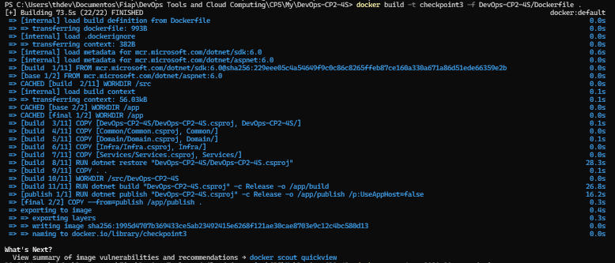
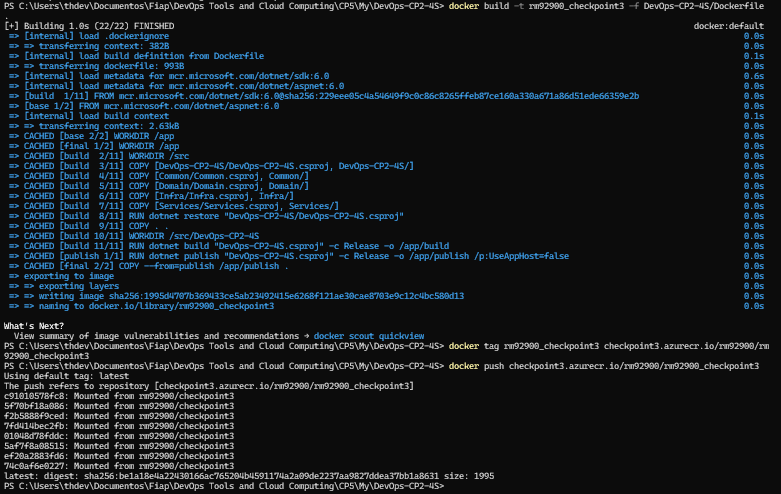
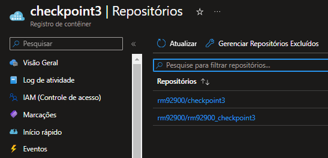
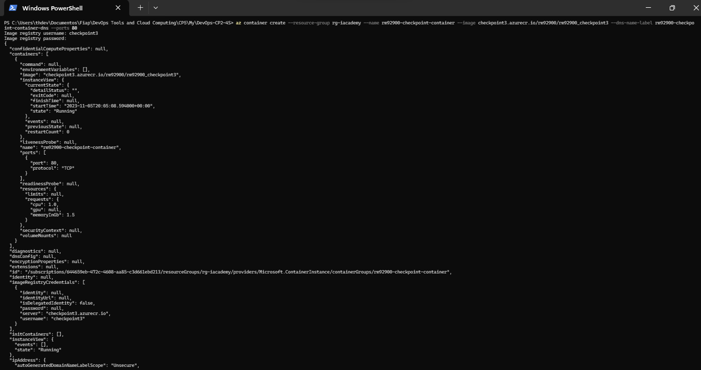
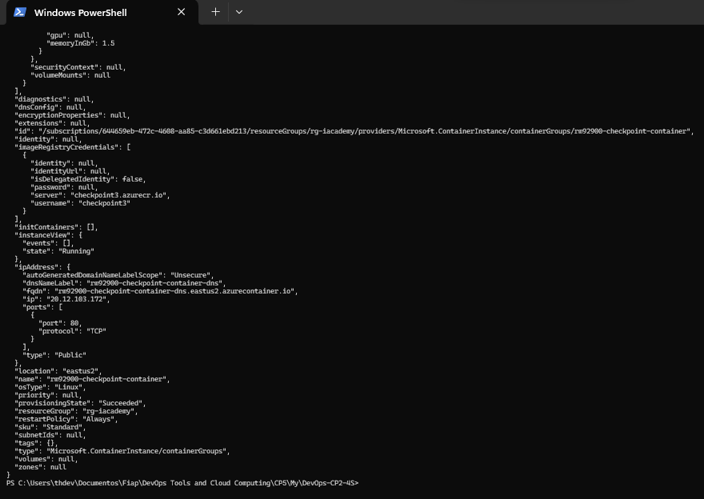
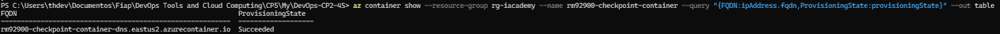
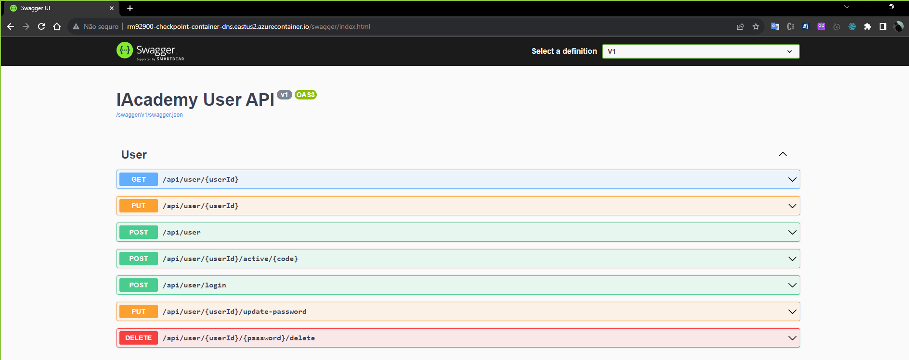

# Processo de Build e Publicação

## 1. Docker Build Local

## 2. Publicação no Azure Container Registry (ACR)

## 3. Repositório ACR na Nuvem

## 4. Criação do Azure Container Instance (ACI) - Parte 1

## 5. Criação do Azure Container Instance (ACI) - Parte 2

## 6. Container Executando na Nuvem - Parte 1

## 7. Container Executando na Nuvem - Parte 2

- [Acesse esse link](https://www.youtube.com/watch?v=SrSPFVgzq7I "Acesse esse link") para ver o vídeo da execução do CRUD da aplicação em nuvem Azure